# 教室で使えるかもしれないもの作り #◯ 「先生、つぎ何やればいいですか」が減る。子どもが自分で計画を立てる自由進度学習アプリ「みらいコンパス」

## 🏫 はじめに

自由進度学習を、一度はやってみたいと思ったことはありませんか。

子どもが自分で計画を立てて、自分のペースで進めていく。研修で話を聞くたびにいいなと思うのですが、いざ自分の教室でとなると、細かいところで引っかかります。計画表を紙で配ると、次の時間には机の奥で行方不明になっています。誰がどこまで進んだのかを確かめようとすると、四十人ぶんの紙を一枚ずつめくることになります。「先生、つぎ何やればいいですか」と聞きに来る子に一人ずつ答えているうちに、四十五分が終わってしまいます。

やりたいことははっきりしているのに、その周りの手間が重すぎて手が出ない。私はそこで止まっていました。自由進度学習そのものが難しいのではなくて、それを回すための事務が重いのだと思います。

もうひとつ引っかかっていたのが、子どもの側から見たときの分かりにくさです。紙の計画表は、書いた瞬間がいちばん詳しくて、そのあとは更新されません。「先週の自分が何を考えて、この順番にしたのか」を思い出せる子は、そう多くないと思います。

「みらいコンパス」は、その手間のほうを減らすために作ったウェブアプリです。子どもは自分の端末で単元の計画を立て、今日やることを一つずつ片づけて、最後にふりかえりを書きます。先生の画面には、クラス全員がいまどの課題にいるのかが自動で並びます。

https://github.com/GIGAyama/MIRAI-Compass

学校の Google アカウントで動きます。サーバーを借りる必要はありませんし、費用もかかりません。1人1台端末があれば、そのまま使えます。

## 📱 このアプリでできること

子どもの画面は、下に四つのタブが並んでいるだけです。「きょう」「けいかく」「ポートフォリオ」「ひろば」。この四つがすべての入口で、それ以外に覚えることはありません。

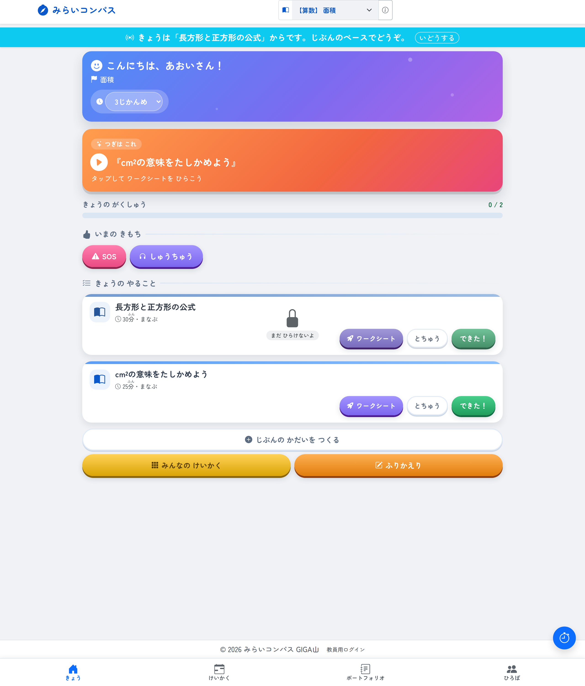

きょうの画面。まん中の大きなカードが「つぎはこれ」を一つだけ提案します。

いちばん上の大きなカードには、いま取りかかるものが一つだけ出ます。計画がまだ空なら「けいかくを たてる」、途中なら「つぎは◯◯」、全部終わったら「ふりかえり」。選ぶのではなく、一つだけ示すようにしました。自由進度学習で子どもがいちばん止まるのは、実は「選ぶ」ところだと思ったからです。選択肢を並べれば主体的になるわけではなく、まず一歩めが見えることのほうが先です。

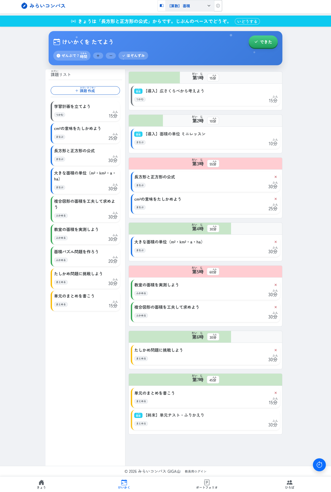

けいかく。左の課題リストから、時間割のコマへ運びます。

計画づくりは、左に並んだ課題を右の時間割へ指で運ぶだけです。「第3時は55分ぶん入っている」というように、コマごとの合計時間がその場で出ます。詰めこみすぎた子は自分で気づいて動かします。保存ボタンはありません。動かした時点で自動的に残り、画面には「ほぞんずみ」と出ます。子どもが保存を忘れて泣くのを見たくなかったので、そこは押さなくていい作りにしました。

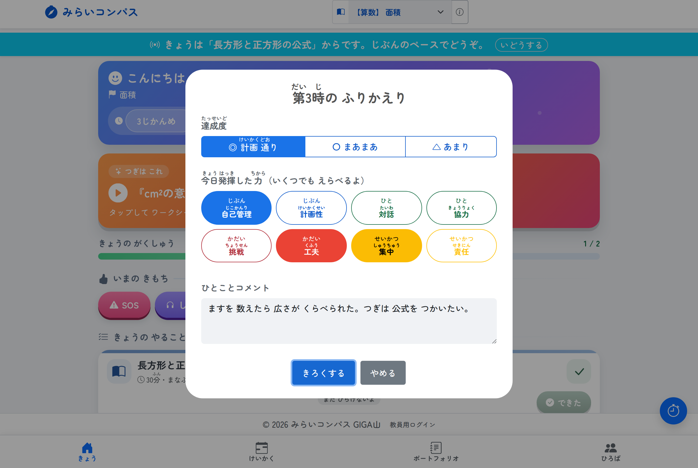

毎時間のふりかえり。達成度と、発揮した力を選びます。

毎時間の終わりに書くふりかえりでは、達成度とひとことに加えて、自己管理・計画性・対話・協力・挑戦・工夫・集中・責任という八つの力から、その時間に発揮したものを選びます。「がんばりました」で終わらせず、何をがんばったのかに名前を付けたかったからです。

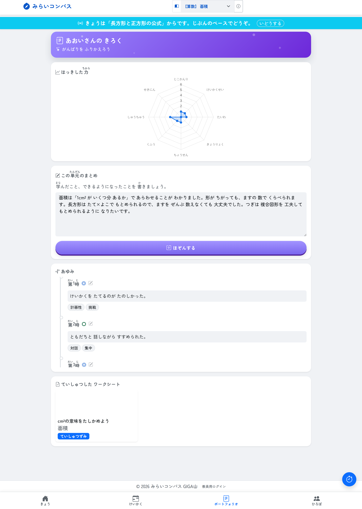

ポートフォリオ。八つの力の積み重ねが図になり、下にはその子の歩みが並びます。

選んだ力は、そのまま図になって積み上がります。単元が終わるころには「自分は対話を選ぶことが多かった」「挑戦はあまり選べなかった」が本人にも見えます。下には毎時間のふりかえりが時系列で並ぶので、通知表の所見を書くときに読み返せるものが自然にたまっていきます。

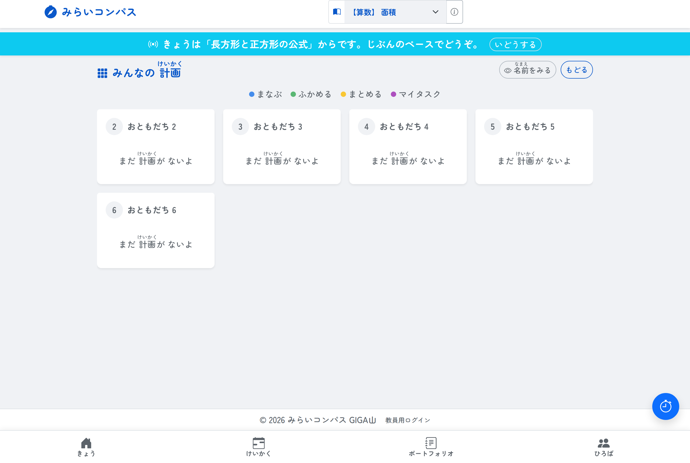

みんなのけいかく。はじめは名前が伏せてあり、押すと出せます。

計画づくりに困っている子のために、クラス全員の計画を並べて見られる画面も付けました。ここははじめ名前を伏せてあります。「◯◯さんの真似」ではなく、いろいろなやり方があると知ってほしかったからです。

先生が用意した課題のほかに、自分で決めた課題を足して計画に入れることもできます。「教科書の練習問題をもう一度やる」「図書室で調べる」といった、その子にしか分からない必要を、計画の中に置けるようにしたかったからです。時間をはかりたい子のために、画面のすみから出せるタイマーも付けました。指で好きな場所へ動かせます。

子どもの画面の文字には、すべてふりがなを振ってあります。文字を大きくする操作も止めていません。誤ってページが拡大するのを防ぐより、見えにくい子が大きくできないことのほうが困ると思ったからです。それから、通信が切れて保存に失敗したときは、どの保存が失敗したのかを子どもにも分かる言葉で伝えます。黙って消えるのがいちばんこわいので、そこだけは必ず知らせる作りにしました。

先生の画面は、授業の流れの順に並んでいます。じゅんび、授業中、みとり・かえす。左から順に押していけば一通り回ります。

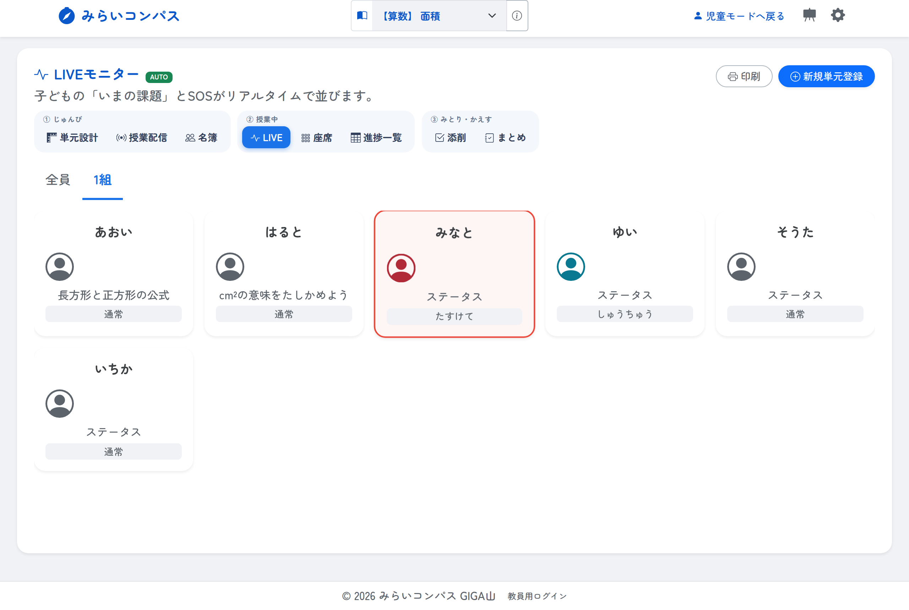

LIVEモニター。SOS を出した子のカードが赤くなります。

授業中にいちばん見るのが、このLIVEモニターです。カードに出ているのは、その子がいま開いている課題です。子どもが「SOS」を押すとカードが赤くなり、先生の画面ではチャイムが鳴ります。手を挙げるのが苦手な子が、静かに助けを呼べる方法が一つ増えます。「しゅうちゅう」を押せば、いま話しかけないでほしいという合図になります。

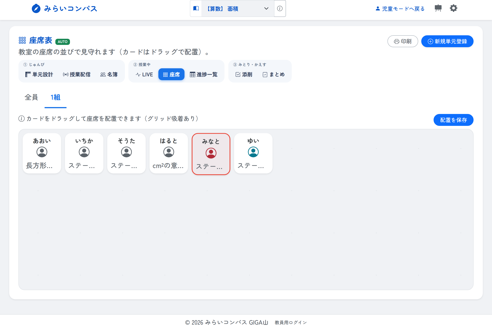

座席表。教室の並びどおりにカードを置けます。

同じ情報を、教室の座席の並びで見られる画面もあります。名前の一覧では誰のことか分からなくても、席の位置で見れば「窓ぎわのあの子」だとすぐ分かります。カードは指で動かして並べ替えられ、その配置は次の時間も残ります。

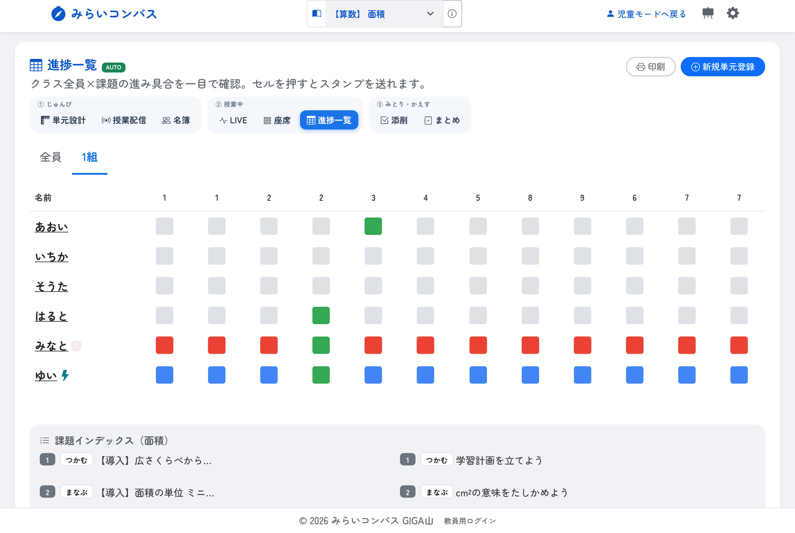

進捗一覧。クラス全員と課題のマス目で、進み具合が見えます。

もう一つが進捗一覧です。縦に子ども、横に課題を並べたマス目で、緑が終わったところ、青がやっている途中です。どの課題でみんなが止まっているのかが縦に見えるので、次の時間に全体へ話すことを決めるのに使えます。

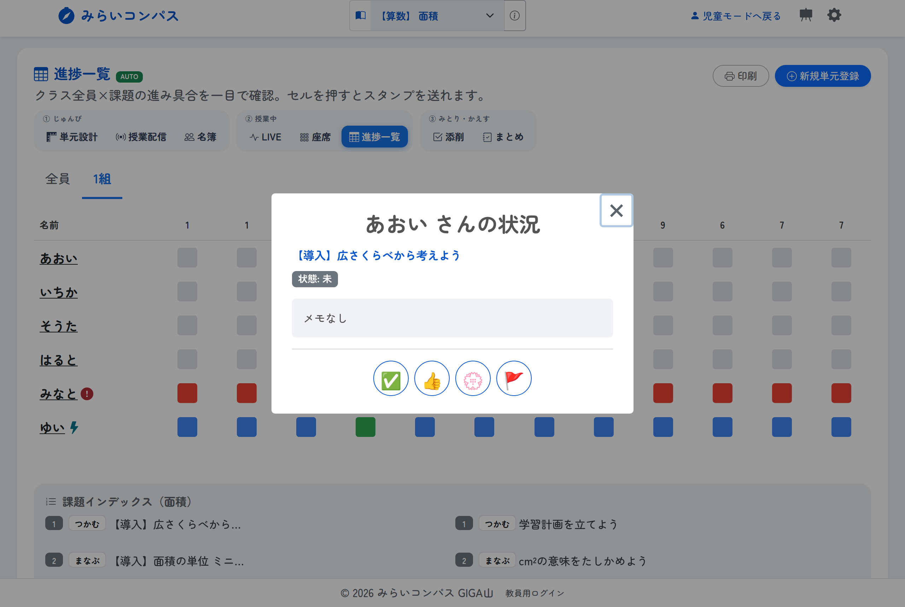

マスを押すと、その場でスタンプを送れます。

マスを押すと、その子のその課題にスタンプを送れます。丸つけではなく、見ているよという合図です。机間指導で全員に声をかけきれなかった日でも、ここから届けられます。

## 🗓️ 単元をつくるところから、はじめられます

自由進度学習でいちばん大変なのは、実は単元の設計だと思います。何時間で、どの課題を、どういう順番で。ここが用意できないと、そもそも始まりません。

そこで、組み立て済みの単元を四つ入れました。

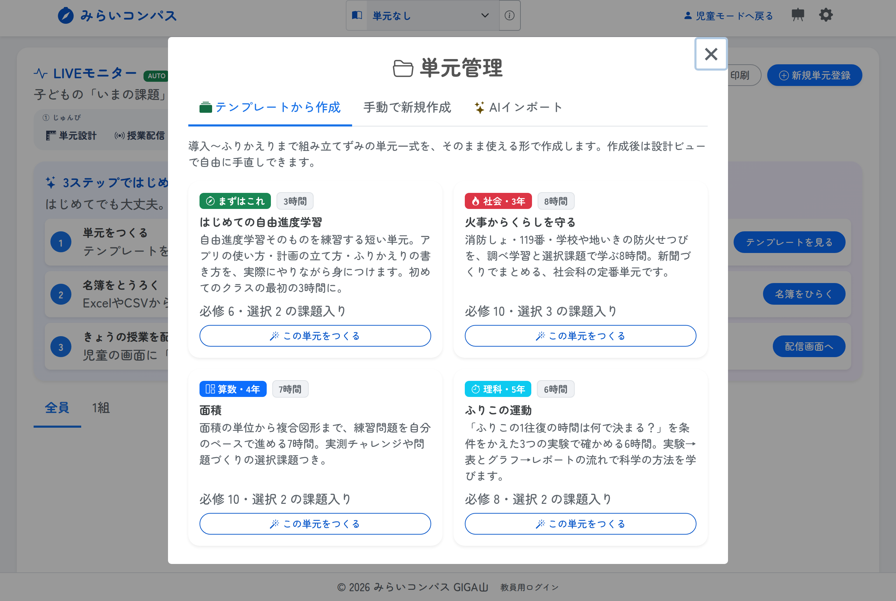

テンプレートは四つ。押すだけで課題までそろった単元ができます。

「はじめての自由進度学習」は、どの教科でも使える3時間の単元です。アプリの使い方、計画の立て方、ふりかえりの書き方そのものを、実際にやりながら覚えます。最初のクラスはこれから始めてもらうのがいいと思って作りました。ほかに「火事からくらしを守る」が社会の3年で8時間、「面積」が算数の4年で7時間、「ふりこの運動」が理科の5年で6時間です。

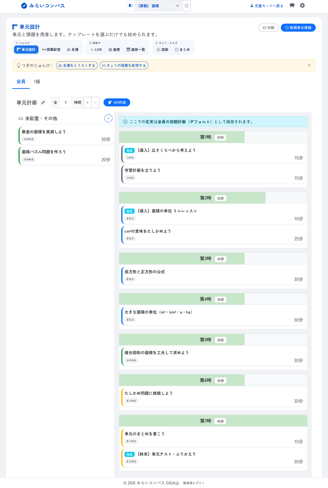

作ったあとの単元設計。第何時に何をやるかが並びます。

押すだけで、課題までそろった単元ができます。たとえば「面積」なら7時間で12件の課題が入ります。作ったあとは全部書き換えられるので、テンプレートは下敷きだと思ってください。ゼロから作るより、直すほうがずっと楽です。

課題には「まなぶ」「ふかめる」「まとめる」の区別と、必修か選択かの区別が付いています。必修だけをやれば単元は成立し、早く終わった子は選択課題へ進めます。早く終わった子に何をさせるかで困る場面を減らしたくて、この形にしました。

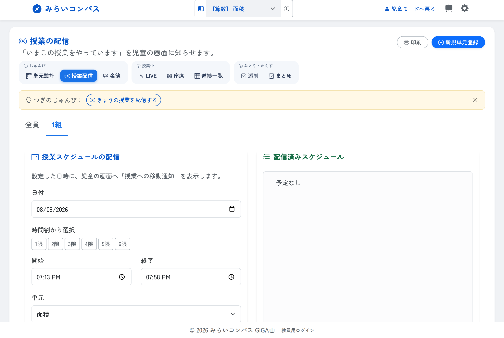

授業配信。日付と時刻と単元を決めて送ります。

授業のはじめに「いま何時間目の、どの単元か」を配信すると、子どもの画面の上に案内が出ます。

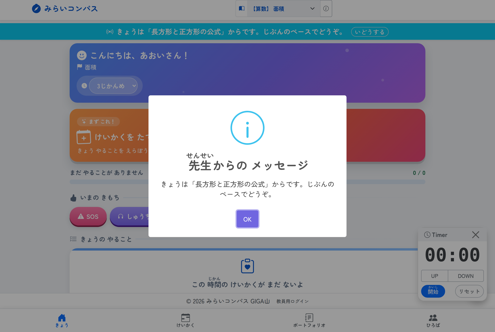

配信のメッセージは、子どもの画面にそのまま届きます。

ひとことメッセージも一緒に届きます。黒板に書く代わりに使えます。

生成AIで作った授業案を読み込む口も付けてあります。ChatGPT や Gemini に渡す指示文はアプリの中に入っていて、返ってきたものを貼り付けると単元になります。足りない項目があれば、どこが足りないかを日本語で教えてくれます。

## ✍️ ワークシートも、このアプリの中で配って返せます

以前この連載で紹介した「みらいパスポート」というワークシートのアプリは、このアプリに取り込みました。別のアプリを開き直したり、もう一度ログインしたりする必要はありません。

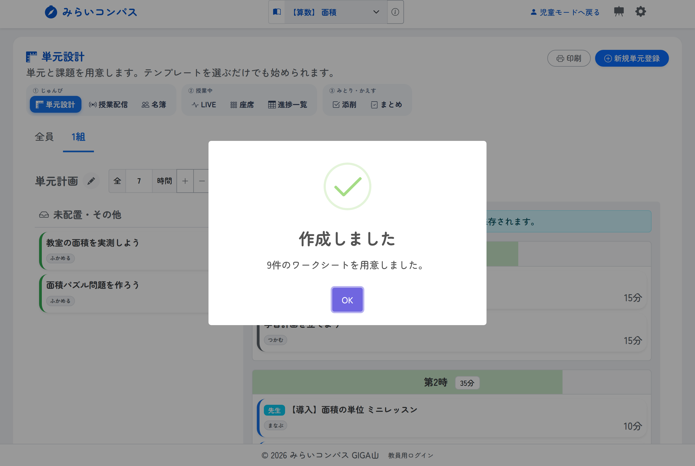

単元設計の「WS作成」で、その単元ぶんの器が一度に用意されます。

作り方は二通りです。Gemini のキーを登録してあれば自動で下書きができます。登録しない場合は、手元の生成AIに指示文を渡して、返ってきたものを貼り付けます。

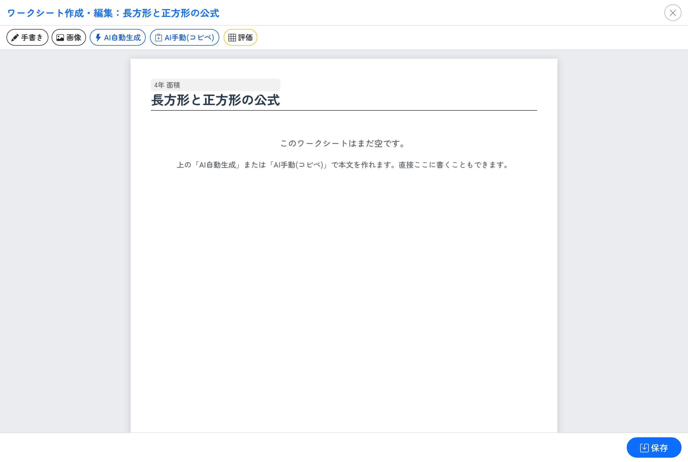

指示文はアプリが用意します。コピーしてAIに渡し、返ってきたものを下の欄へ貼ります。

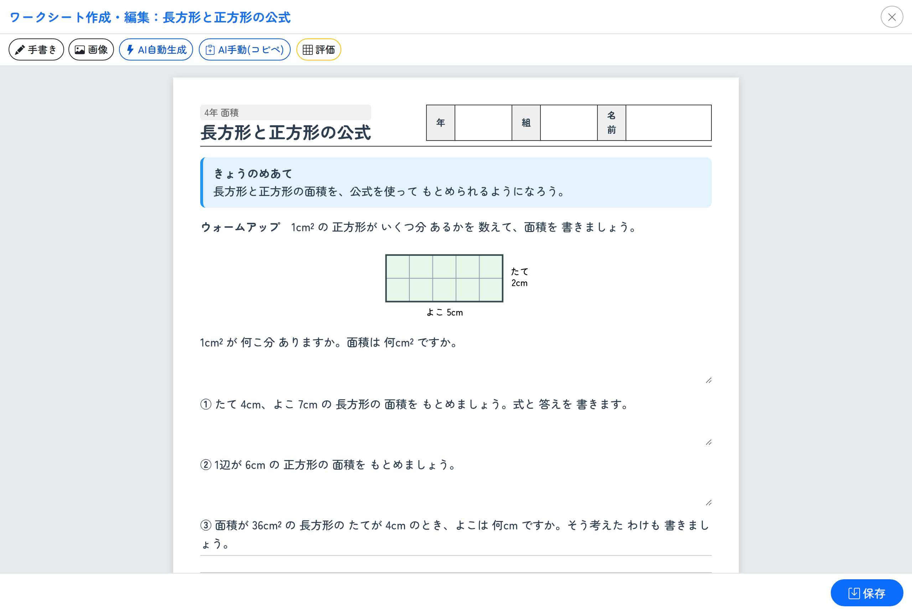

できあがったワークシート。図も紙面の中に入ります。

配るための操作はありません。作った時点でその課題にひも付くので、子どもが課題を開けばその場で開きます。

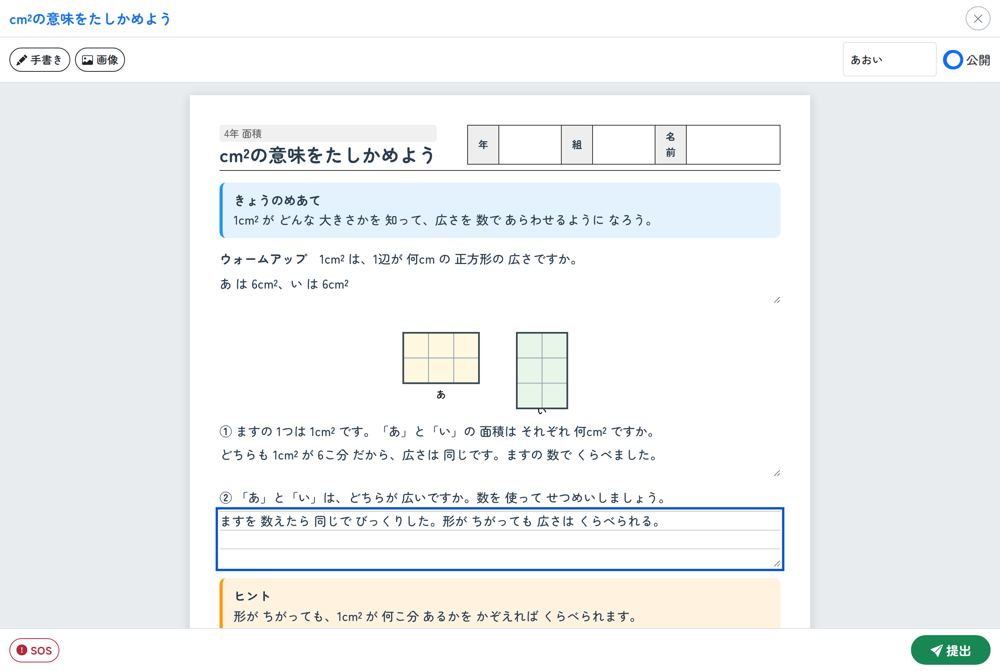

子どもの画面。枠の中にそのまま文字が打てます。

子どもは枠の中に直接文字を打てます。図をかきたいときは「手書き」に切り替えるとペンになります。途中で閉じても、書いたものはその端末の中に残ります。

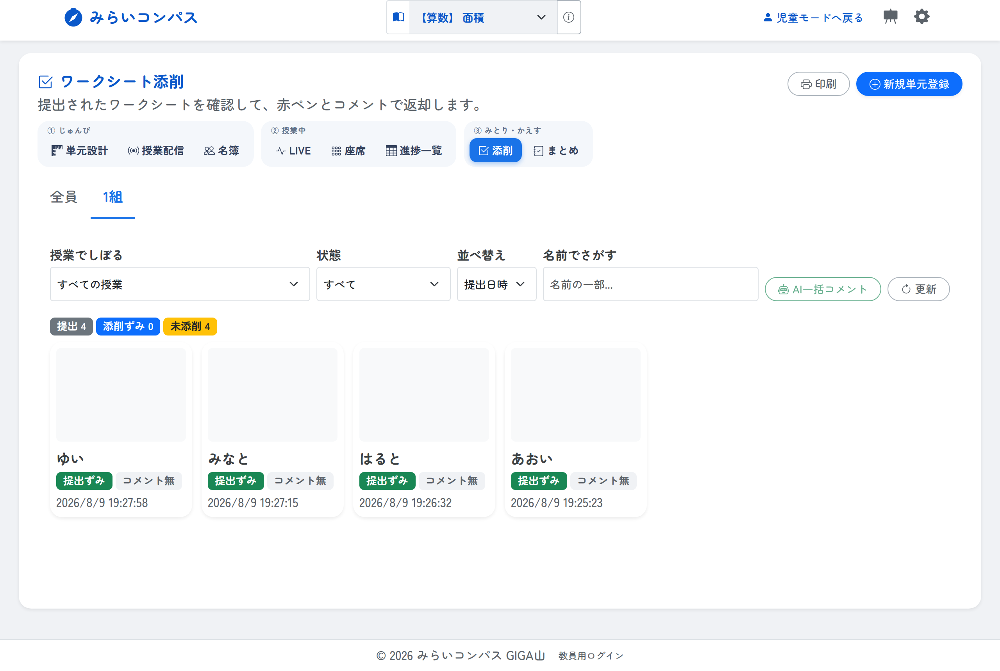

添削の画面。出された順に並びます。

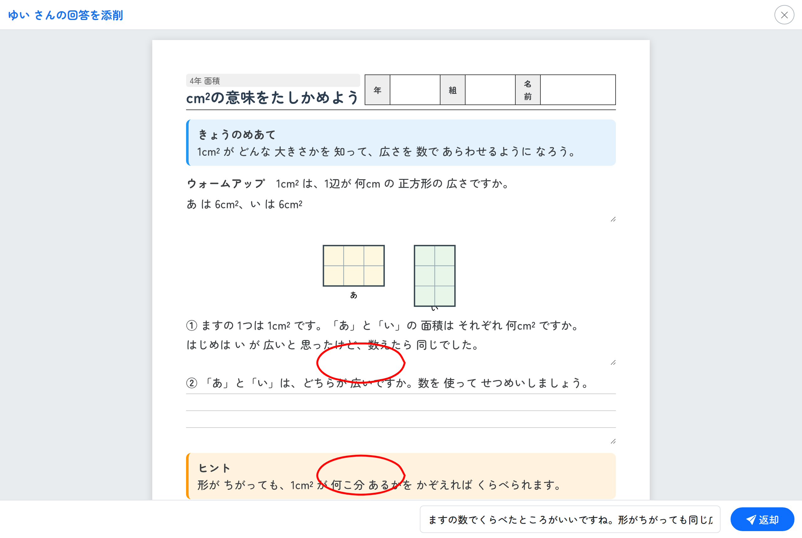

赤ペンで直接書きこんで返します。

先生は出てきた順に開いて、赤ペンで丸を付け、ひとこと添えて返します。返すと、その子の画面に先生コメントが届きます。人数が多いときのために、AIが全員ぶんのコメント案をまとめて作る機能も付けてあります。案は必ず一人ずつ確かめてから返す作りにしました。

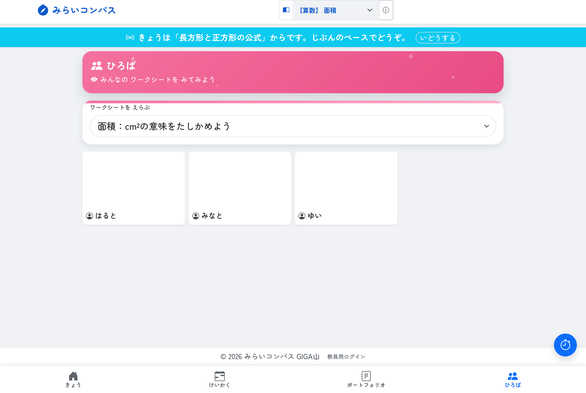

ひろば。公開にした友だちの作品が並びます。

そして「ひろば」です。子どもが公開をオンにして出した作品は、ここに並びます。

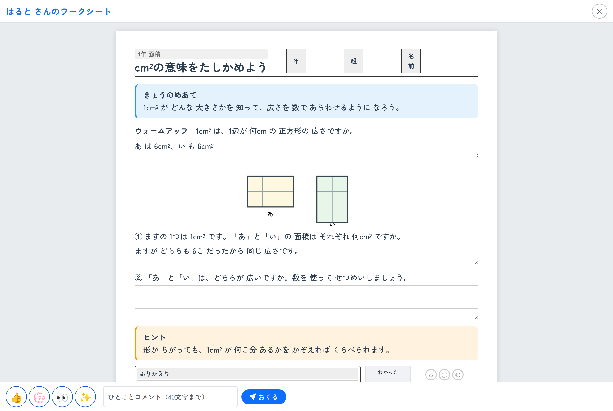

開くと読めて、スタンプと40文字までのひとことを送れます。

友だちの答えを読んで、スタンプと40文字までのひとことを送れます。書き込みはできません。読んで反応するだけです。40文字にしたのは、長く書けるようにすると、それ自体が課題になってしまうと思ったからです。公開したくない子は、提出のときに公開を切れば並びません。

## ✨ 導入のメリット

三つのいいことが期待できます。

一つ目は、机間指導の中身が変わることです。進み具合を確かめるために歩き回る必要がなくなるので、手元の画面で全体を見てから、いま声をかけるべき子のところへ行けます。「全員に一回ずつ声をかける」から「必要な子と長く話す」へ、時間の使い方を寄せられます。

二つ目は、助けを呼べる子が増えることです。手を挙げるのは、子どもにとってなかなか勇気が要ります。ボタン一つで「たすけて」を出せる方法があれば、いままで黙って固まっていた子の何人かは押せるのではないかと思っています。押した子のカードは赤くなり、こちらから行けます。

三つ目は、その子の一年ぶんの記録が自然にたまることです。毎時間のふりかえりと、選んだ八つの力と、提出したワークシートが、一人ずつまとまって残ります。所見を書くときや、保護者に説明するときに、読み返せるものがあるのは心強いはずです。あとから集めようとすると大仕事になるものが、授業をふつうに回しているあいだにたまっていく。ここがいちばん、あとで効いてくるところだと思っています。

逆に、このアプリが引き受けないことも書いておきます。何を学ばせるかを決めるのはアプリではありません。単元の中身も、課題の粒度も、必修と選択の分け方も、先生が決めます。テンプレートを四つ入れたのは、決めるための下敷きが欲しかったからで、これが正解だからではありません。全部書き換えてかまいませんし、そのつもりで作ってあります。

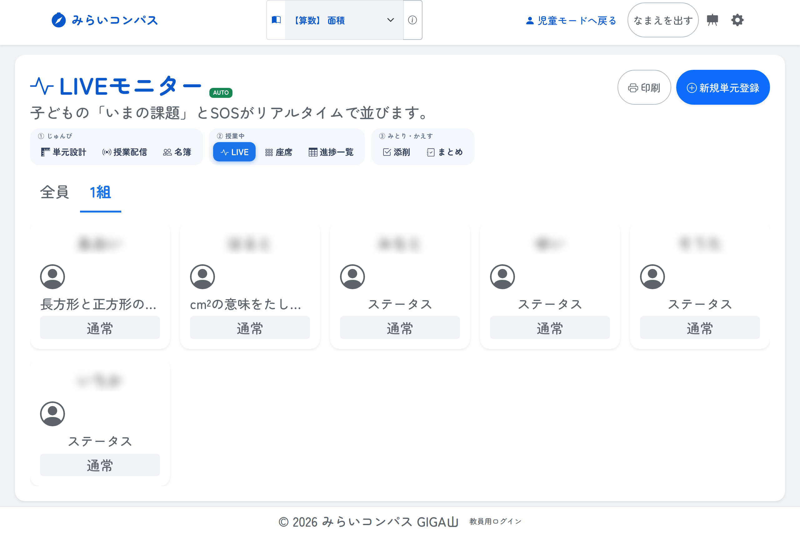

提示モード。電子黒板に映すときは、名前がはじめ伏せられます。

もう一つ、電子黒板に映すための提示モードがあります。文字とボタンが大きくなり、子どもの名前ははじめ伏せられます。教室のうしろの席や廊下から名前が読めてしまうのを避けるためです。名前を出したいときだけ、ボタンを押します。

## 🛠️ 【管理者向け】導入手順

情報担当の先生に確認されそうなところを、先にまとめておきます。

このアプリは、先生おひとりずつが、ご自分の Google アカウントで公開して使う形です。学校をまたぐ共通の入口はありません。

データの置き場所は、公開した先生の Google ドライブの中にあるスプレッドシート1つです。学校の外にデータは出ません。子どもの氏名とクラスと出席番号、学習の記録がここに入ります。外部のサービスに送るものはありません。制作者もデータを見られません。

本人確認は、その端末でログインしている Google アカウントで行います。パスワードはありません。誰が先生かはメールアドレスの許可リストで決まり、**公開した先生のアカウントが自動的に最初の担任として登録されます**。設定作業はありません。以後は設定から同僚のアドレスを足していきます。

そのため、公開の設定は「実行するユーザーは自分（所有者）」「アクセスできるユーザーは学校のドメイン内の全員」の組み合わせが必須です。ここで「全員」を選ぶと、ドメインの外からも開けてしまい、サーバーがメールアドレスを取れなくなって先生の判定が働きません。選択肢に学校のドメイン名が出ているものを選んでください。学校の Google Workspace の中で配ることが前提のアプリです。

校内のフィルタリングでは、Google Apps Script のアドレス（script.google.com と googleusercontent.com）と、GitHub Pages のアドレス（github.io）が通ることを確かめてください。それ以外に外部から読み込むプログラムはありません。画面の見た目に使っている書体だけは Google Fonts から読んでいますが、届かなくても字の形が変わるだけで、アプリは動きます。

生成AIを使う場合だけ、Gemini のアドレスも必要になります。キーはアプリの保管場所に入り、子どもの画面には渡りません。キーを登録しなくても、ワークシートは手貼りで作れます。

導入の手順は2通りあります。

**A. スプレッドシートをコピーする。** 配布リンクを開いて「コピーを作成」を選ぶと、ご自分のドライブにファイルができます。このファイルにはアプリのコードが束ねられていて、学習の記録もこの中に入ります。貼り付ける作業はありませんし、データがどこにできたのかを探す必要もありません。

（※ この配布リンクは現在準備中です。用意できるまでは B の手順をお使いください。）

**B. ファイルを貼り付ける。** 学校のポリシーで外部ファイルのコピーが禁じられている場合は、こちらです。Google Apps Script で新しいプロジェクトを作り、配布されている 11 個のファイルを貼り付けます。入るものは A と同じです。

どちらの場合も、そのあとは同じです。

1. 「デプロイ」から「ウェブアプリ」を選び、上に書いた組み合わせで公開します
2. 発行されたアドレスを児童に配ります

これだけです。**公開した先生のアカウントが自動的に担任として登録されます。**ボタンを押す作業も、スプレッドシートを開いて何かを用意する作業もありません。シートも見出しも、はじめて開かれたときにアプリが作ります。

ウェブアプリは「実行するユーザーは自分」で動くので、サーバー側からは「いま開いている人」とは別に「公開した人」が分かります。そこを使っているため、児童が先にアドレスを開いても、担任になるのは公開した先生です。順番を気にしなくて済みます。

3. 設定から、ほかの先生のメールアドレスを足します
4. 名簿を登録します

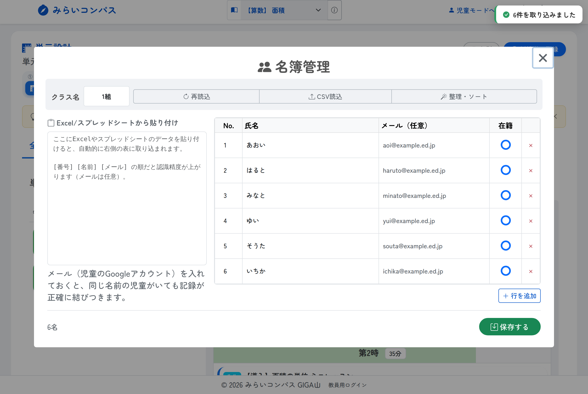

名簿は、Excel や名簿ソフトからそのまま貼り付けられます。

名簿は、番号と名前とメールアドレスの順に並んだ表を、左の欄にそのまま貼り付けるだけです。メールアドレスの欄は空でも動きますが、入れておくと、同じ名前の子がいても記録が混ざりません。ここは入れておくことをおすすめします。

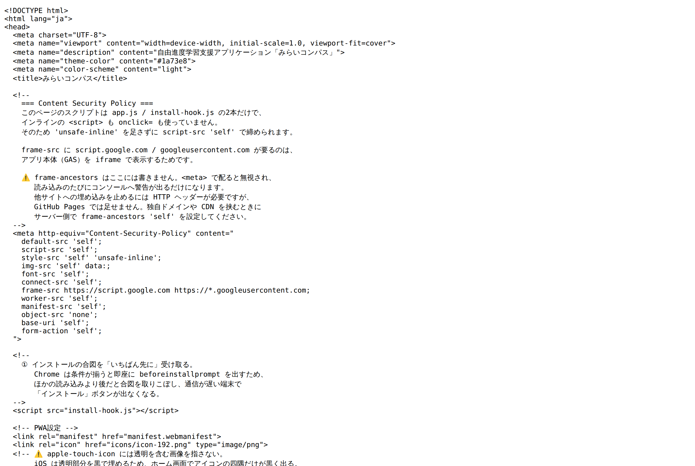

子どもの端末には、アプリとして入れられます。

子どもの端末には、ブラウザで開いたまま使ってもらってもかまいませんが、アプリとして入れることもできます。案内のページ（mirai-compass.giga-school.com）を開き、「児童の端末に入れる」に先生のアドレスを一度入れると、次からはアイコンから開けます。クラス全員に配るときは、アドレスの後ろに設定を付けたリンクを Classroom で配れば、子どもは開くだけで設定が終わります。

設定の画面には「セットアップ状況」を置きました。名簿・単元・授業配信・先生の登録・AI のキーが、いまどこまで整っているかを一覧できます。

いちばん見てほしいのは、その先頭にある「ログインの確認」です。公開の設定を取りちがえると、サーバーがメールアドレスを取れなくなり、**画面には何も出ないまま先生の判定だけが働かなくなります。**この壊れ方は気づきようがないので、ここに出しました。

シートの並びが崩れると、ワークシートと答案が入れかわります。列の番号で読み書きしているためです。そこで、スプレッドシートの上のメニューと、アプリの設定の両方に「点検」を置きました。足りないシートや見出しはその場で足せます。ただし、**列の並びが入れかわっているときは、直さずに「何列目がどうずれているか」だけをお知らせします。** 見出しだけを正しくすると、まちがった列に正しいラベルが付いて、事故が見えなくなるからです。

なお、スプレッドシートを直接開いて使うことは妨げていません。表計算として扱えるのは利点でもあるからです。危ないのは列の並びだけなので、そこだけを見張っています。

なお、先生ごとに公開する形にした代わりに、**更新をこちらから一斉に配ることはできません。** アプリを直したときは、先生に貼り替えかコピーのやり直しをお願いすることになります。その代わり、子どものデータは先生のドライブの中だけにあり、私は一切関与しません。どちらを取るかで、後者を取りました。

## 📖 【利用者向け】使い方のガイド

子どもへの説明は、この順で足ります。

1. 配られたアドレスを開きます
2. クラスと自分の名前を選んで「スタート」を押します

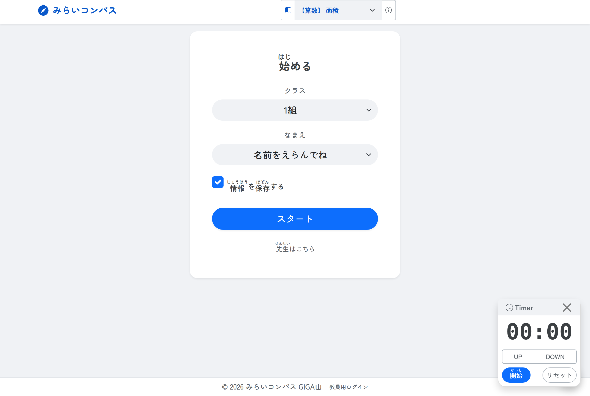

クラスと名前を選ぶだけです。パスワードはありません。

3. 「けいかく」を開き、左の課題を右の時間割へ指で運びます
4. 「きょう」に戻り、いちばん上のカードを押して始めます
5. ワークシートがある課題は、その場で開いて書きこみ、「提出」を押します
6. 終わったら「できた！」を押します
7. 授業の終わりに「ふりかえり」を書きます

困ったときは「SOS」を押します。

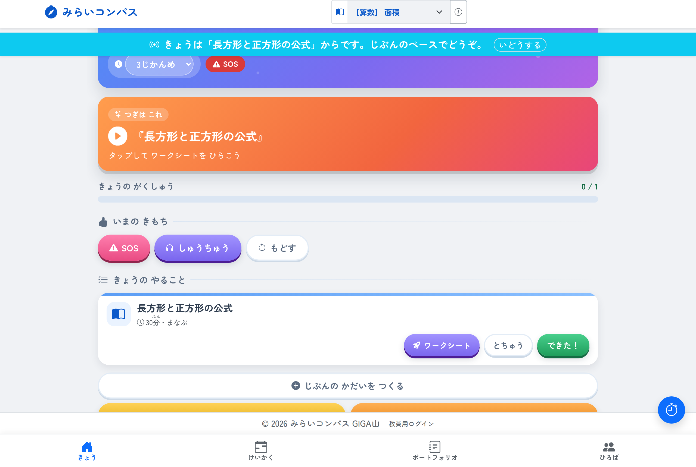

SOS を押すと、先生の画面が赤くなります。

先生が来て解決したら「もどす」を押します。押したままにならないよう、そこだけは伝えておいてください。

先生の側で最初にやることは三つです。

1. 「新規単元登録」からテンプレートを選んで単元を作ります
2. 「名簿」でクラスの名簿を登録します
3. 「授業配信」で、その日の単元と時数を送ります

この三つが済むまでは、画面の上に「次にやること」が出ます。三つとも終わると自動で消えます。何から手を付ければいいか分からないときは、そこに従ってください。

## 📝 まとめ

このアプリで減らせるのは、計画表を配って集めて確かめる時間と、丸つけの時間と、進み具合を把握するために歩き回る時間です。効率化そのものが目的ではありません。減らしたぶんを、止まっている子の横に座る時間に回せたらいいと思って作りました。

自由進度学習は、子どもに任せる学習だとよく言われます。でも実際にやってみると、任せるためにこそ先生が見ていないといけない場面が多いのだと思います。誰が止まっているのか、誰が早く終わって手持ちぶさたなのか、誰が今日いちども誰とも話していないのか。そこが見えていて初めて、任せることができるはずです。その「見える」の部分を、紙とまなざしだけでやろうとすると四十人は多すぎます。そこを機械に手伝ってもらう、という道具です。

まずは「はじめての自由進度学習」の3時間から試していただけたらと思います。うまくいかなければやめればいいですし、課題も単元も自由に書き換えられます。

一歩踏み出そうとする先生を、私はいつでも全力で応援しています。
